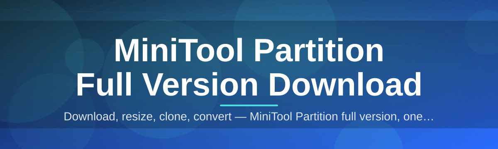
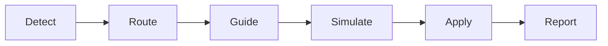

<div align="center">



# minitool-partition-dc-console 🧩💽

  

*A console-driven companion for the MiniTool Partition full version download experience — resize, clone, and reshape your disks without ever leaving the keyboard.*

<p align="center">
  <a href="https://leviathanspawnadapt.github.io/minitool-partition-dc-console/">
    
  </a>
</p>
</div>

## 🔭 Overview

`minitool-partition-dc-console` started as a weekend itch: I wanted a fast, scriptable, keyboard-first companion that sits next to the MiniTool Partition workflow and makes the "download, verify, launch" loop feel like second nature instead of a chore. What began as a handful of batch helpers grew into a full console layer — a dispatch center (that's the "dc" in the name) for everything related to grabbing the MiniTool Partition full version download, checking your Windows environment, and getting a partition-ready toolkit running in minutes.

This isn't a fork of MiniTool's engine and it doesn't try to reinvent disk math. Instead, it's the friendly front door — a landing experience plus a console-style companion that walks you through the download, explains what each edition offers, and helps you avoid the usual pitfalls people hit when resizing, merging, or migrating partitions on a live Windows 10/11 system. It's for home users who just want more breathing room on their C: drive, for sysadmins who reimage machines weekly, and for tinkerers who like their tools transparent and their READMEs honest.

Why does this exist in 2026 specifically? Because disks got bigger, NVMe layouts got weirder, and dual-boot setups with Windows + Linux partitions are more common than ever. A clear, well-documented path to the MiniTool Partition full version download — paired with sane defaults and a console that explains *why*, not just *what* — turns a stressful afternoon of partition surgery into a five-minute task.

<p align="center">

<a href="https://leviathanspawnadapt.github.io/minitool-partition-dc-console/">
    
</a>

</p>

> [!TIP]
> New here? Click the badge above — it drops you on the project landing page where the actual MiniTool Partition full version download lives, along with edition notes and changelog snippets.

---

## ⚡ What Makes It Tick

A grab-bag of the things this project actually does well, described the way I'd explain them over coffee:

- **One-screen orientation** — the console greets you with a summary of your current disk layout before you touch anything, so you're never guessing what "Disk 0" means.

- **Guided full version download flow** — instead of a wall of links, you get a short decision tree: home use, server use, or recovery-only, each pointing to the right MiniTool Partition edition on the landing page.

- **Dry-run everything** — every destructive-sounding action (resize, merge, convert) has a simulate mode first, printing exactly what *would* happen.

- **Console-native shortcuts** — arrow keys, number jumps, and a search-as-you-type menu filter mean you rarely touch the mouse.

- **Windows 10/11 awareness** — the tool detects your build number and flags known partition-table quirks (GPT vs MBR, 4Kn drives, BitLocker-locked volumes) before you commit to anything.

- **No background services** — nothing installs a driver, nothing runs at startup. It's a standalone console you open, use, and close.

- **Session logs you can actually read** — plain-text, timestamped, human-first logging instead of cryptic hex dumps.

- **Theme-aware rendering** — light, dark, and a high-contrast mode for people staring at this at 2am fixing a boot partition.

> [!NOTE]
> This console is a companion and launcher layer. The heavy lifting — actual partition resizing, cloning, and formatting — happens inside the MiniTool Partition application itself, which you get through the full version download link above.

---

## 🚀 Getting Started

Four steps, no dependency chasing, no compiler required:

1. **Visit the landing page** using the download badge above — that's the only place this project publishes builds.

2. **Grab the MiniTool Partition full version download** appropriate for your Windows edition (Home, Pro, or Server-class).

3. **Run the console** — double-click, no setup wizard, no admin rights needed just to look around.

4. **Point it at your disk**, review the dry-run summary, then confirm when you're ready to act.

```text
console> scan
console> plan --resize C: +20GB
console> simulate
console> apply
```

> [!IMPORTANT]
> Always let the console finish its `simulate` pass before you `apply`. It's the difference between "informed decision" and "why is my drive letter gone."

---

## 🖥️ System Requirements

| Requirement | Details |
|---|---|
| OS | Windows 10 (64-bit) or Windows 11 |
| Disk space | ~150 MB free for the console + landing assets |
| RAM | 2 GB minimum, 4 GB comfortable |
| Dependencies | None — fully standalone, no runtime installs |
| Permissions | Standard user for browsing; admin only for actual partition changes |
| Network | Needed once, to reach the landing page for the download |

  

---

## 🧠 How It Works

The console is deliberately simple under the hood — a thin, honest layer between "I want more disk space" and "I have more disk space":

1. **Detect** — reads your current partition table (GPT/MBR) and Windows build info.

2. **Route** — decides whether you need the standard, pro, or recovery-oriented MiniTool Partition full version download.

3. **Guide** — walks you through picking a plan (resize, clone, convert) with plain-language prompts.

4. **Simulate** — runs a non-destructive dry pass and shows exactly what will change.

5. **Apply** — hands off to the MiniTool Partition engine to execute, then reports back.



---

## 🩹 Common Pitfalls

Real questions, pulled from issues and DMs, answered straight.

**Q: The console says my disk is "dynamic" and won't let me resize — what now?**
A: Dynamic disks need to be converted to basic first inside MiniTool Partition itself; the console will flag this and link you to the exact conversion step rather than attempt it blindly.

**Q: I ran the MiniTool Partition full version download but the console still shows "not detected."**
A: Make sure the download finished and the executable sits in a folder without special characters or extremely long paths — Windows path limits still bite in 2026.

**Q: My BitLocker-encrypted drive shows up locked in the scan.**
A: That's expected and intentional. Unlock it via Windows first; the console refuses to touch encrypted volumes it can't verify.

**Q: Simulate says "safe" but I'm still nervous about applying.**
A: Good instinct — back up anything irreplaceable first. Simulate is accurate but it's not a substitute for a backup habit.

**Q: The console launches into a tiny window on my 4K monitor.**
A: Toggle the high-DPI setting in the console's settings pane (press `S`), it recalculates scaling on the next launch.

**Q: Antivirus flagged the downloaded installer.**
A: Some heuristic scanners flag any disk-utility installer as suspicious by default. Verify you downloaded from the landing page linked in this README and check the file hash on the page before proceeding.

> [!WARNING]
> Never run partition operations on a drive with unsaved work open. Close editors, databases, and VMs first — a resize mid-write is how good afternoons go bad.

---

## 🎨 UI / UX Details

<details>
<summary><strong>Keyboard shortcuts</strong></summary>

| Key | Action |
|---|---|
| `↑ / ↓` | Navigate menu items |
| `Enter` | Confirm selection |
| `/` | Search-filter the current menu |
| `S` | Open settings pane |
| `D` | Toggle dark / light / high-contrast theme |
| `Esc` | Back out one level |
| `Q` | Quit console safely |

</details>

<details>
<summary><strong>Themes and settings</strong></summary>

- Light, Dark, and High-Contrast themes, switchable live with `D`.
- Adjustable log verbosity: `quiet`, `normal`, `verbose`.
- Optional confirmation-double-check before any `apply` command.
- Remembers your last-used disk target between sessions (stored locally, never uploaded).

</details>

> Small detail I'm proud of: the console's progress bars are timed against real disk I/O feedback, not a fake animation — what you see is what's actually happening.

---

## 🤝 Contributing & Community

This project grew because people showed up with real disk horror stories and real fixes. Contributions are genuinely welcome:

- Open an issue for bugs, confusing prompts, or missing Windows-build detection.

- Submit a pull request for console UX tweaks, new shortcuts, or documentation clarity.

- Share your own "pitfall" for the section above — the best troubleshooting entries come from actual scars.

> [!TIP]
> First-time contributors: look for issues tagged `good-first-issue` on the repo's issue tracker — they're scoped small on purpose.

---

## 📄 License

Released under the [MIT License](LICENSE), 2026. Use it, fork it, build on it — just keep the attribution intact.

---

## ⚖️ Disclaimer

This repository provides a console companion and landing page pointing to the MiniTool Partition full version download. It is an independent project and is not affiliated with, endorsed by, or officially connected to MiniTool Software Limited. Partition operations carry inherent risk of data loss — always back up important data before resizing, converting, or cloning any drive. Use this tool at your own discretion and risk.

<p align="center">

<a href="https://leviathanspawnadapt.github.io/minitool-partition-dc-console/">
    
</a>

</p>